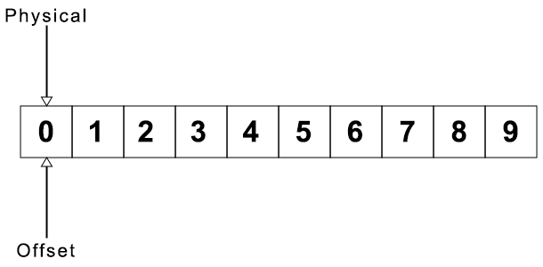
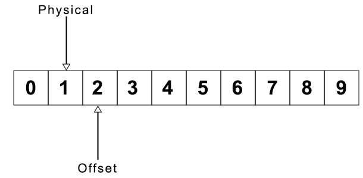

<div  style="text-align: right">
    
</div>

# Introduction

The Enigma is a rotary cypher device that dates back to soon after WW I and was
invented by German engineer Arthur Scherbius. The German Military, both the Navy
and the Army, adopted it in the late 1920s and kept modifying it up to the End
of WW II. This device had a theoretical 3 X 10¹¹⁴ possible starting points.
Specifically, as configured by The German military, this device had 10²³
possible "keys". <sup>[1][2]</sup>

<br/><div>
    <div></div>
    <b>Enigma Machine</b>
</div><br/>

The Enigma was comprised of several components, such as the keyboard, lamp
board, three or four rotors and a reflector, all of which, combined, produced
the cypher. However, there were some weaknesses in the system that provided
enough predictability to allow the Allies to eventually crack the device.
Examples of these weakness include the reflector, which although it made the
cipher symmetrical so encoding and decoding used the same setup, also resulted
in no letter encoding to itself, and the consistent means used to advance the
rotor.<sup>[3][4]</sup> There were human weaknesses as well. One of the jobs of
the operator was to choose a three-letter code or set of numbers as part of the
message to be sent. But much like pin numbers, many operators used the same code
many times, either codes with personal meanings, or those that were easily
chosen. <sup>[5]</sup>

<div>
    <div></div>
    <b>A detailed look at the rotors</b>
</div><br/>

## Device Setup
There were three settings used to prepare the device for daily operation. These
were determined in advance and published monthly in a key sheet so that all
devices could be configured consistently.<sup>[14]</sup>

<div>
    <div></div>
    <b>Example Monthly Key Sheet</b>
</div><br/>

On this sheet you can see these three settings, the rotor settings, the ring
settings and the plug board settings. Each day on the sheet had four sets of
three letter identifiers, called the key identifier. This identifier was sent as
part of each message and could be used to find the settings used to encode
it.<sup>[6]</sup>

## Operation
The setup of the Enigma was done by an officer who was in possession of the
monthly key sheet. After setup, the Enigma would be locked. An operator was
unable to make any changes, and so used this same configuration all day.<sup>[7]</sup>
However, if every message is sent with the same setup, this would result in more
messages encoded identically providing more data for code breakers to analyze.
But for proper decoding the sender and receiver of a message needed to setup
the Enigma identically. <sup>[7]</sup>

## Start Position
On a band around the outside of the rotor was printed the numbers 01-26, or the
letters A-Z. This represented the current rotation of the rotor. There is a
small window on the device where the operator can view this rotation and a wheel
they can use to change its position.

<div></div>

Before every message was sent, the rotors were turned to an arbitrary position,
and that position was transmitted along with the message, so the receiver could
position the rotors in the same way to decode it.<sup>[9]</sup>

# How does it work
At is simplest, the Enigma has a keyboard at one side, and a lamp board on the
other. There are 26 keys on the keyboard, and 26 lights on the lamp board, each
labeled with the letters A-Z. Out the back of the keyboard are 26 electrical
connectors. When the letter A is pressed, one of those connectors has a charge.
We will call that the A connector. Another connector is the next alphabetical
letter until it wraps around from Z to A. There is a similar set of connectors
attached to the lamp board. If you removed all the other circuitry, the A key
is wired to the A lamp, and so on all the way to Z. pressing the A key on the
keyboard will light A on the lamp board. Pressing M would light M, etc.

<div>
    <div></div>
    <b>Overly simplified Enigma</b>
</div>

## Encoding Disc
Of course, this doesn't really provide any encryption at all. That's what the
rest the Enigma circuitry is for. Between the keyboard and the lamp board we can
insert a disk that has connectors on both sides, the connectors from the
keyboard come in one side--we'll call that the input--and the connectors that
send the signal to the light board come out the other--the output. To provide a
basic encryption the input connector encodes to a different output connector.
For instance, if we encoded A to X, then, when a signal came in on the A
connector, it would output on the X connector. When you press A, X would light
up. This is called a substitution cypher.

<div></div>

This encoding disc is a little better, but substitution cyphers are very easy to
break <sup>[10]</sup>. Let's mix it up a bit and insert a few more disks in
there, each wired differently. Maybe A goes to Q and Q goes to F and F goes to
the lamp board as M. Looking at it, though, that's no better. Pressing A will
always light up F, it's just a longer path to get a substitution cypher.

## Rotor
It would be better to get a different output every time  you press the same key.
On the Enigma, on every key press, the first disk is turned so that the same
input line from the keyboard is output to a different line to the light board.
For example, if before rotation, input A from the keyboard connected to output
X, after rotation input A would output somewhere else entirely. What used to be
the connection from line A has been shifted to get input from line B, and rather
than outputting to X, the output has also shifted to line Y.

<div></div>

This rotating disc is called a rotor. If we continue to rotate the disc on every
key press, we will end up with 26 different ways to map connector A from the
keyboard to the lamp board. But 26 possible variations of key mapping are not
a very secure cypher. To improve it we can add a second rotor that moves one
step, when the first rotor has completed a full circuit. For even more security,
we can also add a third. Theoretically, this gives us 26³ possible output
mappings. But due to double stepping, explained later the actual number is
25x25x26 combinations, or 16,900<sup>[12]</sup>

## Reflector
Our system now has a keyboard, three rotors, and a lamp board. To increase
complexity, the Enigma sends the output back through the same rotors. To
accomplish that it uses a reflector. The reflector is wired to only have
connectors on one side. In input connector into the reflector is wired to
another connector on the same side for output. This pairs the connectors, so
that a signal coming in on A might output on connector M, and input on M would
output on A.

A quick note, because the signal from the keyboard comes in from the right side,
and the rotors are inserted left to right, the first rotor getting a signal from
the keyboard is the last rotor inserted. Rotor numbers will be counted from the
right to the left, so that on a three rotor system, the third inserted rotor is
numbered rotor 1.

After the signal hits the reflector, it heads back into the last rotor and
works its way back to rotor one. When it comes out of rotor one, it is then sent
off to the light board that connects to the corresponding light.

# More Details
The above were just some general principles. The Enigma gets more complicated as
you dig into the details.

## Wiring
Inside each rotor an input connector is physically wired to the output
connector. It is this wiring that determines the unique encoding associated
with each rotor type.

## Plug board
The plug board sits between the keyboard and the first rotor. The plug board has
26 cable connectors, each labeled with a letter from A-Z. Using a cable, the
operator can connect any two letters together, so that a signal coming on one
will instead output on the other connector. In operation, the Enigma used ten
connections. This plugboard increased the strength of encryption considerably
with 150 trillion possible setting.<sup>[11]</sup>

<div></div>

## Entry Disk
The entry disk sits between the plug board and the rotor one. On the military
model, this was a straight pass through, having no effect on the output. But
different variations on the Enigma used different entry discs. <sup>[13]</sup>

## Rotor Rotation
Stepping is the process of advancing the rotor 1/26th of a rotation. On every keypress rotor one will always step, for the other rotors this will happen
when the notch of the rotor to its right is at its turnover point. However, when
a rotor does step it will also step the rotor to its right. Because of this,
when the second rotor steps so that it's notch is at the turnover point this
will cause rotor three to step on the next keypress, thus taking rotor two with
it. This is called a double step, since rotor this leads rotor two to step on
two consecutive key presses.


## Setup
There are three settings on the Enigma that can be configured to produce
different results for the same input. These are the rotor setup, the plug
configuration and the ring settings.

**Rotors** The most common Enigma System had space for three rotors. In the
Enigma model I these rotors were chosen from a possible five, numbered I-V, and
could be placed in any order. The M3 model had up to eight rotors to choose
from.

**Plug configuration** Each setup could connect up to ten cables into the plug
board, linking together twenty letters in pairs.

**Ring Setting** The ring setting is used to change the input connectors
relative to the internal wiring. The band of letters or numbers around the rotor
used to identify the current rotation is not fixed to the rotor wiring but can
be rotated independently. Changing the position of this band also changes the
position of the notch that results in turnover. In this picture you can see the
two notches on the band with the letters.

<br/>
    <div><b>Disassembled rotor</b></div>
    <div></div>
<br/>

This has the effect of modifying the relationship between the letter or number
displayed in the window and the physical rotation of the rotor, as well as the
relative position of the of where turnover takes place.

The configuration of the Enigma was changed daily, and these settings were
determined in advance in monthly intervals and made available in the field for
daily setup.<sup>[14]</sup>

# Writing a simulation
This document will assume the emulation of the Enigma I, although supporting the
M3 is not much more difficult, except for the handling of two turnover points.

When simulating the Enigma there are several different components of the device
that will need to be modeled. The keyboard, rotors, reflectors, etc. Many of
these components share some functionality, most obviously they take an input
value and output a different value that has been encoded. But before we can do
any of this, we will need to determine what we are modeling and what values we
are using to represent this model. In the big picture the input into the system
is the letter pressed on the keyboard, and the output is the letter lit on the
lamp board. But between the keyboard and the lamp board, there are no letters,
just electricity moving through connections between the different components of
the system.

## Coordinate Systems
When an electrical signal enters a rotor it does so on an input connector and
outputs on another one. To model them, we need to provide an identity for each
connector. Since the Enigma is a piece of hardware, these connectors have a
position in real space. Because the process is initiated with the flow of an
electrical signal out of the keyboard, we can use that connection as a basis for
our identities. This can either represent the letter pressed or use a number
corresponding to the position of the letter in the alphabet. In code,
manipulating numbers is more convenient than letters, so that is probably the
best idea. Connector zero is positioned where the letter A comes out of the
keyboard, connector one is B, etc. To understand how these values are assigned
you can draw an imaginary line from the keyboard to the lamp board which will
pass through every component, intersecting connectors along the way. The
connectors where they intersect can be numbered accordingly. You can  get the
idea looking back at my diagrams above:

<br/><div></div><br/>

On each component connector zero is the connector aligned along the path from A
on the keyboard to A on the lamp board. Easy enough. But it gets
tougher when you consider rotation. There needs to be a definition of how the
input connector for a rotor maps to the output. For instance, the definition of
that path in Rotor I is typically expressed as "EKMFLGDQVZNTOWYHXUSPAIBRCJ".
Input into connector A (one) outputs at connector E (five), and B to K, C to M.
etc. But after stepping once, the input A connector is no longer in the same
physical space as it was. It now sits at B. But our connection map remains the
same. To use our connection map, we need a different internal numbering system
than the external numbering system. Which also means we will need a way to
translate from one to the other. We can refer to these as the logical and the
physical coordinate systems.

## Modeling the system
Using an object-oriented paradigm, we can model each component as a class, and
create specific instances of these classes when constructing the simulation.
Here is the list of the various component to model.

- **Keyboard** since this is the entry into the system and simply outputs on the
connector associated with the letter, unless there is a visual user interface,
it is probably not necessary to model and user input can be replaced by a method
on the Enigma class itself.

- **PlugBoard** this class is a basic encoder, it receives an input on a
connector and outputs on another. The constructor will need to be passed the
plug settings, and an internal map will need to be created to specify this
encoding.

- **EntryDisc** although the entry disc on the Enigma I is a simple pass
through, not all models were so simple. By modeling this component, the
simulation can be more complete.

- **Rotor** this will be the most complicated object to model. It will need to
handle encoding, rotation, ring settings, message start position and turnover.

- **Reflector** the reflector is a bit unique; it only has one set of
connectors, and input and output happen on the same set. Each connector is wired
in pairs so that input on one of these connectors outputs on the other. Because
of this, a connector cannot map to itself.

- **LampBoard** like the keyboard, the lamp board is an end point in the
process, and does no encoding. This can probably be replaced by the output of
the Enigma encode methods.

- **Enigma** this is the interface to the device itself. Based on the
configuration of the Enigma, it will create instances of the other
classes and configure each one. Its tasks will be to take input from the user
and pass this through all the components and output back the final encoded
value. It will also need to get feedback from the rotors to know when to
trigger the next rotor in the device to advance and handle the double stepping.

One detail to keep in mind is that since most of the encoders in the system are
run through twice, once on the way to the reflector, and once on the way back,
and because the input to output paths will be different in both directions,
there will need to be a way to let these encoding objects know which direction
the signal is coming from. In the actual hardware the signal moves from right to
left on the way to the reflector and left to right on the way back. We
can identify our encoding direction using these terms.

## Specifics
We can break each of these classes down into more detail

**Encoder**

This is the base class that most other classes will inherit from. This needs to
represent two specific operations, encoding to the right and encoding to the
left. The actual implementation of these methods would be in the classes that
extend the Encoder class. This can be done with either a single method that
takes a parameter for the direction, or two separate methods, one for each
direction. This would also be a convenient place for any common logic that will
be needed by the descendent classes.

**PlugBoard**

The plug board takes as a configuration of up to ten pairs of linked letters.
This will be used to create an internal map of how input connectors and output
connectors are translated. These connectors can be modeled in many ways. If we
look back up at the key sheets distributed for daily setup, they were specified
as two letters separated with some white space. Using a string like this, or an
array of two letter strings, are both valid ways to specify the plug settings.
Or for more flexibility, both. Because the input and output are linked in pairs,
encoding is the same in both directions.

**EntryDisc**

The implementation in this simulation will simply be a passthrough on input
connector to output connector. But since there are other entry discs for
different models of the Enigma. For completeness, you may want to consider
allowing a connection map like the one that will be used for rotors.

**Rotor**

Setup of the Rotor needs a few things: the connections map, the ring settings
and the positions of the notch or notches where turnover happens. Turnover is
the point where stepping a rotor results in the stepping of the next. The
standard five rotors only have one turnover position, but other models like the
M3 had two. For completeness handling this as an array of turnover locations is
probably a good idea.

<u>*Connections map*</u> - This specifies how connections are mapped between
input and output connectors. This is given in various sources as a list of
letters, where the position of the letter in the list represents the logical
input coordinate, and the value in the array at that index specifies the logical
output coordinate. As this is the standard used in all documentation, this
should be the format used in this class. It's important to remember that the
rotor will need to encode in both the right and left directions. The connections
map is only provided for encoding to the right. A separate map will need to be
derived for the other direction. The connections map is part of the hardware of
the rotor and is not itself configurable.

<u>*Rotation*</u> - The rotor rotates counterclockwise when viewed from the
right side; when viewed from the front it rotates towards the
operator.<sup>[8]</sup> The numbers or letters viewed through the window
increase on every step. We can model this rotation as an offset from zero
rotation. When the operator sets the initial position before every message, this
will increase the distance between zero rotation and the offset. Because control
of this offset is driven by external factors such as stepping and the message
start position, the rotor should expose methods to set and increase the current
offset, but never change it because of internal methods.

<br/>
    <div><b>Exploded view of a rotor</b></div>
    <div></div>
<br/>

<u>*Turnover*</u> - This is the location where the rotor lets the Enigma know
that it needs to step the next rotor. Since these turnover locations are
physical locations on the rotor itself, like the connections map, they are not
something that needs to be configured but are part of the description of the
rotor. Also, like the connection map, they are in logical coordinate space and
will need to be part of the conversion from physical to logical space and back.
This turnover location is typically specified as a letter that represents the
point to perform the turnover. An important point, the turnover occurs when
stepping passes this point, not when it gets to this point. <sup>[8]</sup>

Double stepping also needs to be taken care of. This occurs when rotor three
steps and rotor two is at its turnover point.<sup>[8]</sup>

<u>*Starting Rotation*</u> - at the beginning of every message the operator will
set the rotors to an initial rotation. As said above, rotation is specified as
an offset from 0 rotation, which is defined as the point where logical and
physical coordinates are the same.

<u>*Ring Setting*</u> - Attached to the rotor is a movable ring printed with the
letters A-Z or the numbers 1-26. Changing the position of this ring has the
effect of shifting the internal wiring of the rotor relative to its inputs. This
affects both the starting rotation position, as well as the relative location of
the notch that leads to turnover.

The ring setting changes the number or the letter viewed in the window for the
same physical rotation. Because the rotation value seen by the operator
increases on every step, changing the ring position forward rotates the ring
towards the operator, in the same direction that the rotor rotates. Which means
that it decreases the distance from zero rotation. To account for this, when
setting the start position, the ring setting will need to be subtracted from
that value.

In addition to changing the initial offset of a message, the ring setting also
changes where the physical rotation of turnover happens. Because the position of
the notch that causes turnover moves with the rotation of the outer ring and
relative positions are aligned with the location of the internal wiring, the
ring setting will need to be added back into the current rotation to check for
turnover.

Different models specify ring settings in different ways, either as a letter or
as a number. However, since it will be the Enigma class that receives
these settings during configuration, the rotor class can decide how to represent
this value. Since we will be translating this setting to a number internally,
taking this setting as a number is probably the easiest. It will be the job of
the Enigma to do the translation during its own configuration. This
setting is configurable as part of the daily setup but is not changed during
regular operation.

<u>*Coordinate Conversions*</u> - Because logical coordinates are internal to
the rotor, they are not something passed to the rotor's methods. All coordinates
passed to the Rotor class are physical coordinates and will need to be converted
back and forth. Understanding how these two coordinate systems relate can be
hard to visualize. Below are four examples with two different ways to view this
relationship. The first image of a set shows the relationship between the number
of the input connector and the rotation offset. The second shows rotation by
mimicking the physical rotation by shifting the display of the connectors.
Using this image, you can see how the rotation offset and connection map line up
with the physical coordinates. The first set is for zero rotation, where the
physical coordinates match the logical.

<br/><div>
    <div><b>Zero Rotation</b></div>
    <div>  </div>
<div><br/>

Stepping once increases the distance from zero rotation, so adds 1 to the
offset, which is the distance from zero rotation. So, if a signal comes through
on physical coordinate 0, this maps to logical coordinate 1. That logical
coordinate is used as an index into the connection map to look up the output
connector:

<br/><div>
    <div><b>Rotated Once</b></div>
    <div>   </div>
<div><br/>

And of course, rotating one more time, sets the offset to 2:

<br/><div>
    <div><b>Rotated twice</b></div>
    <div>  </div>
</div><br/>

To map the physical coordinate to the logical coordinate, you need to add the
rotation offset to the physical coordinate. In the previous examples we used a
physical coordinate of 0, which resulted in the rotation offset itself being the
logical coordinate. But here is what is looks like when the signal comes in on
physical coordinate 1 with the same rotation.:

<br/><div>
    <div><b>Connector 1</b></div>
    <div> </div>
</div><br/>

Here the changed relationship between physical coordinates and the rotation
offset is clearer.

Using the calculated logical coordinate, we can find the logical coordinate for
the output connection. In this example it is logical coordinate 8. Since the
Enigma class only understand physical coordinates, this needs to be
converted back. To do that you perform the opposite operation and subtract the
rotation offset from the output coordinate. In this case, in the second image,
you can see how logical coordinate 8 lines up with physical coordinate 6. Using
the above formula of subtracting the rotation offset from the logical coordinate
(8-2) produces the correct physical coordinate 6.

**Reflector**

Because the reflector is the point where encoding to the right stops, and
encoding back to the left starts, it only needs to encode in one direction, and
the Enigma class will need to handle it separately. There are three
standard reflectors that are defined and which to use is part of the Enigma
system hardware. The connection specification is given using the same notation
as the rotors, where the position in the connection map represents the input
connector and the value represents the output connector.

**Enigma**

The Enigma class pulls it all together. It can be configured in three
different ways.

*hardware specification* which does not change and should be part of the
construction of the class. This would be the plug board (but not the cable
settings), the encoding disc and the reflector.

*configuration* these are the values that were determined at the beginning of
every day. This would be the list and order of rotors, the cable configuration
for the plug board and the ring settings.

*starting rotation* which is set before encoding a message.

When creating the Enigma system, the entry disc and reflector are specified by
model number, not by their configuration parameters. This will require some sort
of registry or repository where these are stored and can be retrieved by name.
This is similar to the selection and ordering of rotors when configuring the
device which are also given by name.

An example of this might be

```javascript
let Enigma = new Enigma("I", {reflector: 'B'});

Enigma.configure({
    rotors: ['II', 'I', 'V'],
    ringSettings: 'AAA',
    plugs: ['AB', 'IR', 'UX', 'KP']
});
```

In this example, during construction, the reflector is specified, but the
entry disk defaults to the standard model for the Enigma Model I. It is then
configured with the rotors to use, ring settings, and plugs for the plug board.
These two types of configurations are kept separate, since they are conceptually
different, and the same Enigma instance could be used with multiple
configurations.

There were two different standards for specifying the ring settings, one is as
a list of numbers and one is as a string of letters. Your system should accept
either, but remember that the numbers will be specified starting from 1, and not
0.

The last setting is the start position set before encoding. This can either be
a separate call, which would be necessary if your simulation takes a keypress at
a time, or a parameter passed to encode a whole string. Both types of entry
points could be available on this class.

**Inventory Management**

There will need to be some system that can be used by the Enigma to get
the configurations for the different components by name. This could be as simple
as a set of Objects keyed on the name of the configuration, or as complicated as
a new class that allows the addition and retrieval of the different
configurations.

## Closing

This should provide enough information with enough detail to create your own
Enigma simulation. Included in this tool kit is a reference implementation that
you can use to verify the different components of your system as you develop
them. There is also test data available and an entire API to generate test data
of your own.

# External Links
## Simulations
- Enigma I and M3: https://www.101computing.net/enigma-machine-emulator/
- Multiple machine emulator: https://cryptii.com/pipes/enigma-machine
- Multiple machine emulator: https://palloks.2ix.de/enigma/enigma-u_v262_en.html

## Sample Data
- http://wiki.franklinheath.co.uk/index.php/enigma/Sample_Messages
- Large repository of M4 messages: https://enigma.hoerenberg.com/index.php?cat=The%20U534%20messages

## General Information
- https://ciphermachines.com/enigma
- https://www.cryptomuseum.com/crypto/enigma

# References
[1] Rijmenants, D. (2022, November 20). Enigma machine. Retrieved December 30, 2022, from https://www.ciphermachinesandcryptology.com/en/enigma.htm#origins

[2] Simpson, R. (n.d.). The History and Technology  of the  Enigma Cipher Machine. Cipher Machines. Retrieved December 30, 2022, from https://ciphermachines.com/enigma

[3] Wikimedia Foundation. (2022, December 27). Cryptanalysis of the Enigma. Wikipedia. Retrieved December 30, 2022, from https://en.wikipedia.org/wiki/Cryptanalysis_of_the_Enigma

[4] Simpson, R. (n.d.). The History and Technology  of the  Enigma Cipher Machine. Cipher Machines. Retrieved December 30, 2022, from https://ciphermachines.com/enigma

[5] Wikimedia Foundation. (2022, December 27). Cryptanalysis of the Enigma. Wikipedia. Retrieved December 30, 2022, from https://en.wikipedia.org/wiki/Cryptanalysis_of_the_Enigma#Key_setting

[6] Rijmenants, D. (2022, May 19). Enigma Message Procedures. Enigma procedure. Retrieved December 30, 2022, from https://www.ciphermachinesandcryptology.com/en/enigmaproc.htm

[7] Rijmenants, D. (2022, May 19). Enigma Message Procedures. Enigma procedure. Retrieved December 30, 2022, from https://www.ciphermachinesandcryptology.com/en/enigmaproc.htm

[8] Enigma. (2022, June 6). Retrieved February 22, 2025, from https://www.cryptomuseum.com/crypto/enigma/working.htm

[9] Battery and energy technologies. The Enigma Cipher Machine and Breaking the Enigma Code. (n.d.). Retrieved December 31, 2022, from https://www.mpoweruk.com/enigma.htm

[10] Wikimedia Foundation. (2022, December 28). Substitution cipher. Wikipedia. Retrieved December 31, 2022, from https://en.wikipedia.org/wiki/Substitution_cipher

[11]Wikimedia Foundation. (2022, December 30). Enigma machine. Wikipedia. Retrieved January 4, 2023, from https://en.wikipedia.org/wiki/Enigma_machine#Plugboard

[12] Wikimedia Foundation. (2022, December 30). Enigma machine. Wikipedia. Retrieved December 31, 2022, from https://en.wikipedia.org/wiki/Enigma_machine#Turnover

[13] Wikimedia Foundation. (2022, December 30). Enigma machine. Wikipedia. Retrieved December 31, 2022, from https://en.wikipedia.org/wiki/Enigma_machine#Entry_wheel

[14] Simpson, R. (n.d.). The History and Technology  of the  Enigma Cipher Machine. Cipher Machines. Retrieved February 22, 2025, https://ciphermachines.com/enigma.html#ops

APA citation for this repository: Anderson, G. Enigma Machine Toolkit [Computer software]. https://github.com/Ondoher/enigma
